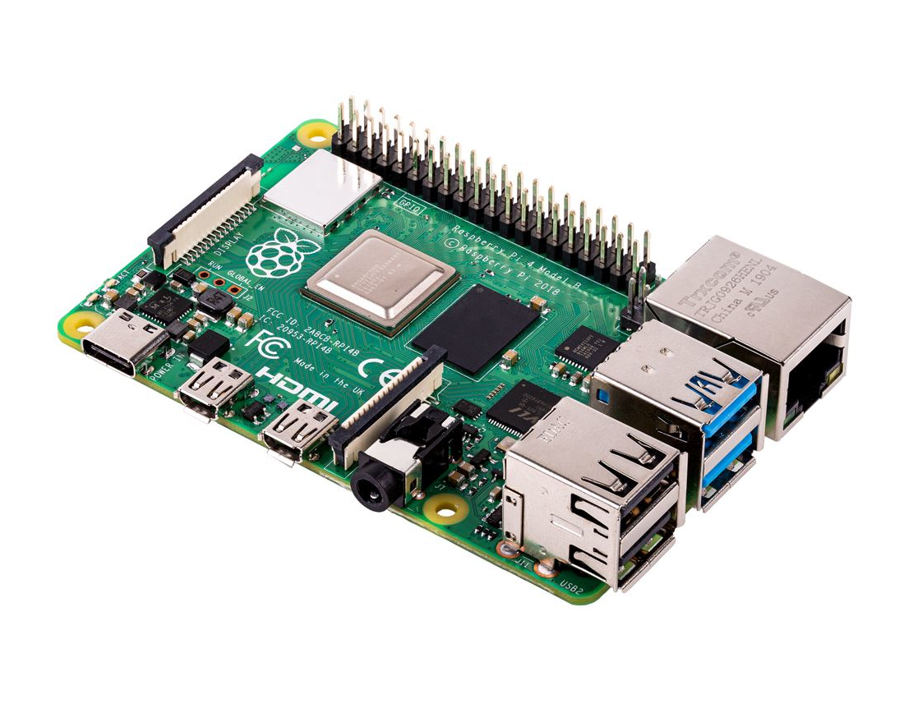

# Raspberry

<p align="center">
  
</p>

Raspberry Pi is a series of small single-board computers (SBCs) developed in the United Kingdom by the Raspberry Pi Foundation in association with Broadcom. The Raspberry Pi project originally leaned towards the promotion of teaching basic computer science in schools and in developing countries. The original model became more popular than anticipated, selling outside its target market for uses such as robotics. It is widely used in many areas, such as for weather monitoring, because of its low cost, modularity, and open design. Next, you can see the specifications for the Raspberry 4 Model B used for the experiments.

* Broadcom BCM2711, Quad core Cortex-A72 (ARM v8) 64-bit SoC @ 1.5GHz
* 4GB LPDDR4-3200 SDRAM
* 2.4 GHz and 5.0 GHz IEEE 802.11ac wireless, Bluetooth 5.0, BLE
* Gigabit Ethernet
* 2 USB 3.0 ports; 2 USB 2.0 ports.
* Raspberry Pi standard 40 pin GPIO header (fully backwards compatible with previous boards)
* 2 × micro-HDMI ports (up to 4kp60 supported)
* 2-lane MIPI DSI display port
* 2-lane MIPI CSI camera port
* 4-pole stereo audio and composite video port
* H.265 (4kp60 decode), H264 (1080p60 decode, 1080p30 encode)
* OpenGL ES 3.1, Vulkan 1.0
* Micro-SD card slot for loading operating system and data storage
* 5V DC via USB-C connector (minimum 3A*)
* 5V DC via GPIO header (minimum 3A*)
* Power over Ethernet (PoE) enabled (requires separate PoE HAT)


## Headless setup

[Raspberry Pi Imager](https://www.raspberrypi.com/software/) is the quick and easy way to install Raspberry Pi OS and other operating systems to a microSD card, ready to use with your Raspberry Pi. It is extremely useful, just select the operating system, the SD card and add the settings you want (wifi, ssh public key, user and password, etc.). For the experiments, the Ubuntu server 20.04.5 LTS (64 bits) operating system was used. After configuring the raspberry with RPI Imager, you 
should be able to see two partitions (`boot` and `system`). In the `boot` partition, there will be a file called `network-config` that looks like this:
```yaml
version: 2
wifis:
  renderer: networkd
  wlan0:
    dhcp4: true
    optional: true
    access-points:
      "LabVISIO - 2.4GHz":
        password: "abcde..."
```

To set a static IP, it should look like:
```yaml
network:
  version: 2
  wifis:
    renderer: networkd
    wlan0:
      access-points:
        LabVISIO - 2.4GHz:
          password: "XXXXXXXXXXXX"
      dhcp4: false
      addresses: [10.20.1.254/16]
      gateway4: 10.20.255.254
      nameservers:
        addresses: [8.8.8.8,8.8.4.4]
      optional: true
```

Now just power the raspberry with SD card. You should be able connect to it using ssh.

## Using 5Ghz network

Install `raspi-config` tool:
```bash
sudo apt-get update
sudo apt-get -y install libnewt0.52 whiptail parted triggerhappy lua5.1 alsa-utils
wget -p -O ./raspi-config_20221214_all.deb  https://archive.raspberrypi.org/debian/pool/main/r/raspi-config/raspi-config_20221214_all.deb
sudo dpkg -i ./raspi-config_20221214_all.deb
```

Then, run `sudo raspi-config` and go to "Localisation Options" then "Change Wi-fi Country". Set it your country. After that, just edit `/etc/netplan/*.yml` file to use your 5Ghz network. Finally, runs:
```bash
sudo netplan try
sudo netplan apply
```

## Resources

* [Raspeberry PI Wikipedia](https://en.wikipedia.org/wiki/Raspberry_Pi)
* [Raspberry 4 Model B specifications](https://www.raspberrypi.com/products/raspberry-pi-4-model-b/specifications/)
* [Raspberry 4 doesn't work 5Ghz wifi](https://forums.raspberrypi.com/viewtopic.php?t=261777)
* [How to install raspi-config on ubuntu](https://dexterexplains.com/r/20211030-how-to-install-raspi-config-on-ubuntu)
* [Install a local kubernetes with microk8s](https://ubuntu.com/tutorials/install-a-local-kubernetes-with-microk8s#1-overview)
* [Installing microk8s on a Raspberry Pi](https://microk8s.io/docs/install-raspberry-pi)